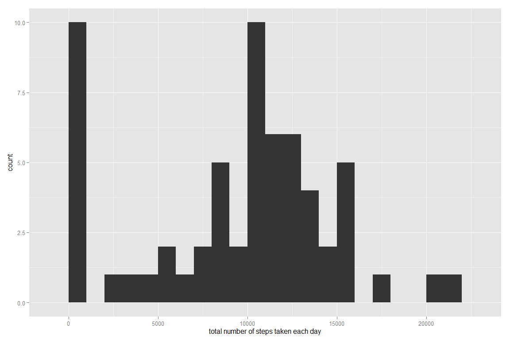
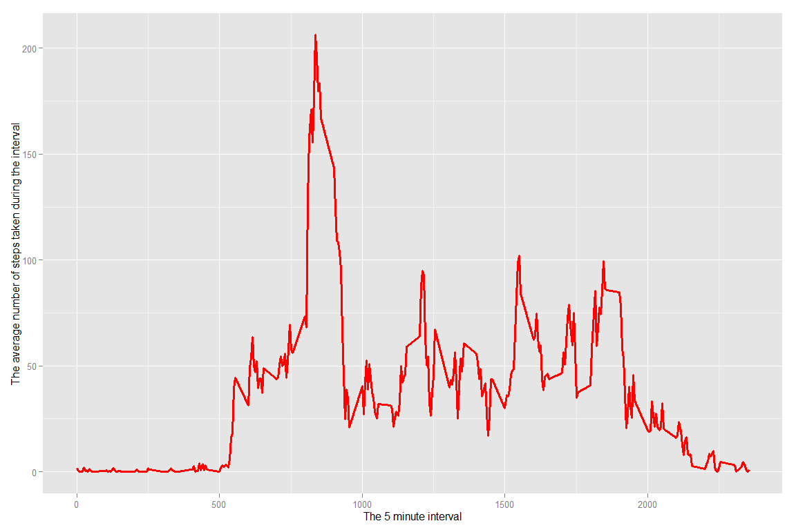
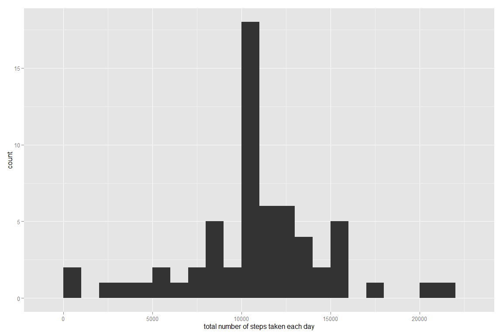
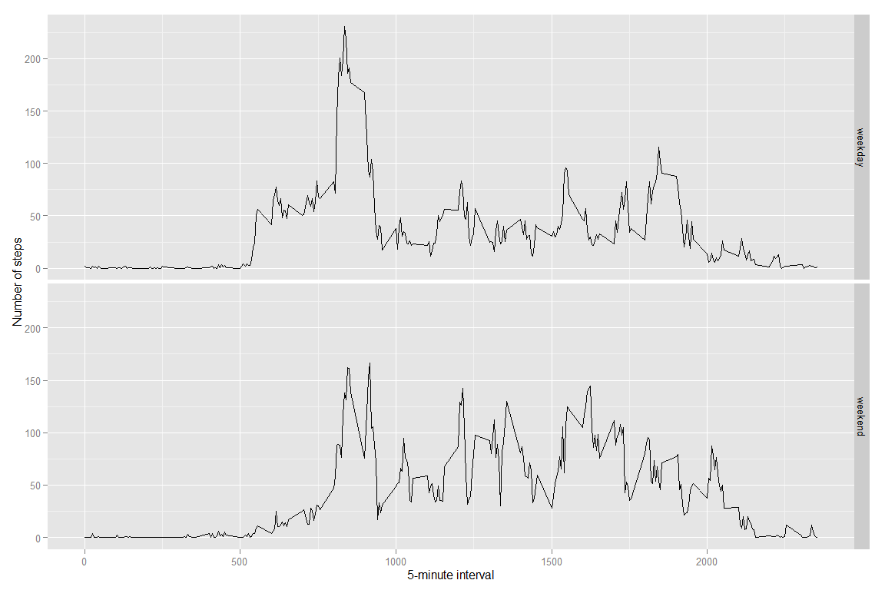

# Reproducible Research: Peer Assessment 1


## Loading and preprocessing the data


```r
#Loading packages
library("ggplot2")

RawData <- read.csv("activity.csv")
```
## What is mean total number of steps taken per day?

```r
totalsteps <- tapply(RawData$steps, RawData$date, sum, na.rm = TRUE)
qplot(totalsteps, binwidth=1000, xlab="total number of steps taken each day")
```

 

```r
mean(totalsteps)
```

```
## [1] 9354.23
```

```r
median(totalsteps)
```

```
## [1] 10395
```
## What is the average daily activity pattern?

```r
averages <- aggregate(x = RawData, by=list(interval = RawData$interval), FUN = mean, na.rm = TRUE)
averages <- averages[,1:2]

ggplot(data = averages, aes(x = interval, y = steps)) + geom_line(colour = 'red', size = 1.1) + xlab("The 5 minute interval") + ylab("The average number of steps taken during the interval")
```

 

```r
maxvalue <- subset(averages, steps == max(averages$steps))
```
## Imputing missing values

```r
sum(is.na(RawData$steps))
```

```
## [1] 2304
```

```r
RawDatacopy <- RawData

for (i in 1:nrow(RawDatacopy)){
  if (is.na(RawDatacopy[i,1]) == TRUE){
    properinterval = RawDatacopy[i,3]
    intervalsubset <- subset(averages, interval == properinterval)
    RawDatacopy[i,1] = intervalsubset[1, 2]
  }
}

totalsteps2 <- tapply(RawDatacopy$steps, RawDatacopy$date, sum, na.rm = TRUE)
qplot(totalsteps2, binwidth=1000, xlab="total number of steps taken each day")
```

 

```r
mean(totalsteps2)
```

```
## [1] 10766.19
```

```r
median(totalsteps2)
```

```
## [1] 10766.19
```
## Are there differences in activity patterns between weekdays and weekends?

```r
weekdayweekend <- function(date) {
    day <- weekdays(date)
    if (day %in% c("Monday", "Tuesday", "Wednesday", "Thursday", "Friday"))
        return("weekday")
    else if (day %in% c("Saturday", "Sunday"))
        return("weekend")
}
RawDatacopy$date <- as.Date(RawDatacopy$date)
RawDatacopy$day <- sapply(RawDatacopy$date, FUN = "weekdayweekend")
averagescopy <- aggregate(x = RawDatacopy, by=list(day = RawDatacopy$day, interval = RawDatacopy$interval), FUN = mean, na.rm = TRUE)
averagescopy <- averagescopy[,1:3]
ggplot(averagescopy, aes(interval, steps)) + geom_line() + facet_grid(day ~ .) + xlab("5-minute interval") + ylab("Number of steps")
```

 
